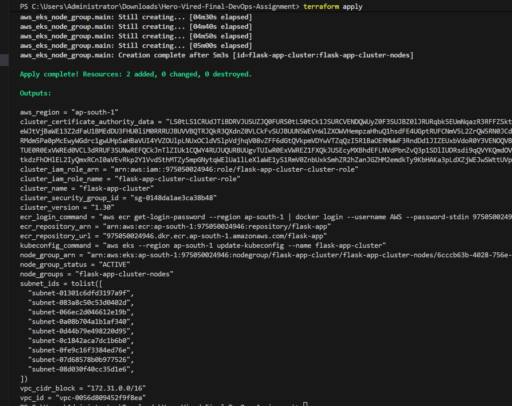
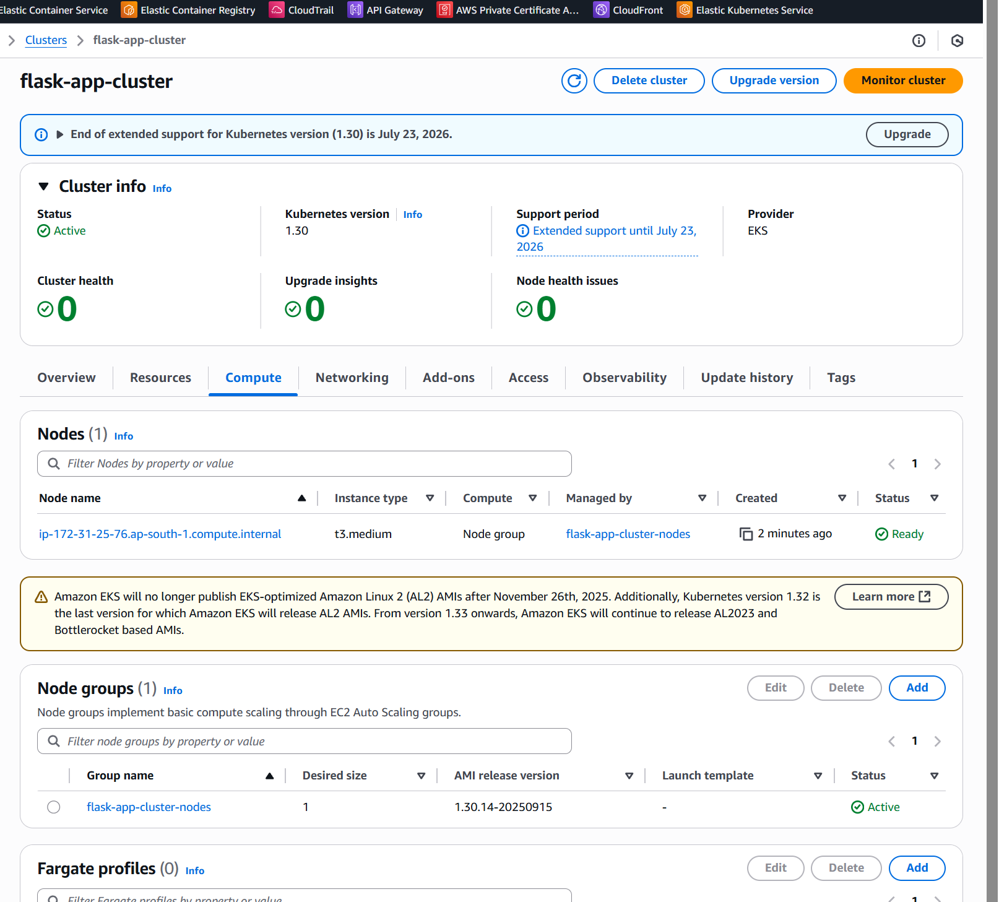
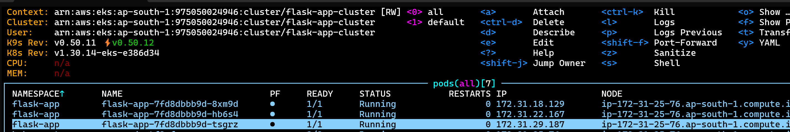
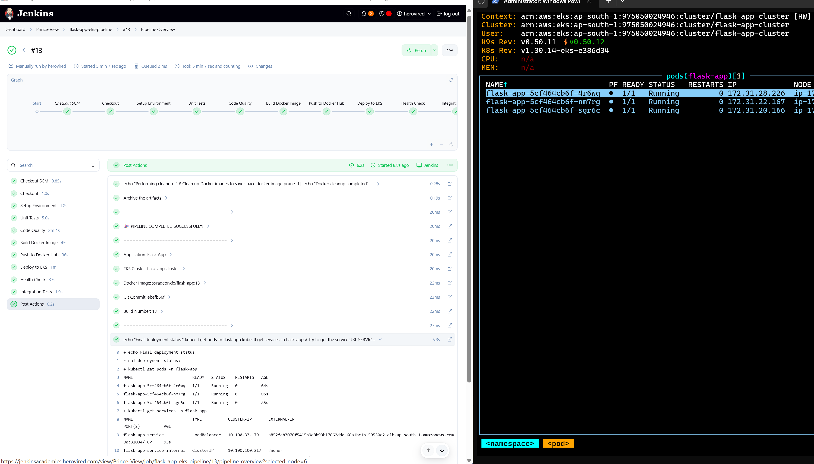

# Flask App on AWS EKS with CI/CD Pipeline

A complete DevOps implementation demonstrating the deployment of a Python Flask application to AWS EKS using Jenkins CI/CD pipeline, Terraform infrastructure as code, and Kubernetes orchestration.

## Table of Contents

- [Architecture Overview](#architecture-overview)
- [Features](#features)
- [Prerequisites](#prerequisites)
- [Quick Start](#quick-start)
- [Project Structure](#project-structure)
- [Infrastructure Setup](#infrastructure-setup)
- [CI/CD Pipeline](#cicd-pipeline)
- [Application Details](#application-details)
- [Kubernetes Deployment](#kubernetes-deployment)
- [Monitoring and Observability](#monitoring-and-observability)
- [Security Considerations](#security-considerations)
- [Troubleshooting](#troubleshooting)
- [Contributing](#contributing)

## Architecture Overview

```
┌─────────────────┐    ┌─────────────────┐    ┌─────────────────┐
│   Developer     │    │    Jenkins      │    │   AWS EKS       │
│                 │───▶│   CI/CD         │───▶│   Cluster       │
│   Git Push      │    │   Pipeline      │    │                 │
└─────────────────┘    └─────────────────┘    └─────────────────┘
                                │                       │
                                ▼                       ▼
                       ┌─────────────────┐    ┌─────────────────┐
                       │   Docker Hub    │    │ Application     │
                       │   Registry      │    │ Load Balancer   │
                       │                 │    │                 │
                       └─────────────────┘    └─────────────────┘
```

### Components

- **Application Layer**: Flask REST API with task management functionality
- **Container Registry**: Docker Hub for container image storage
- **Infrastructure**: AWS EKS cluster provisioned via Terraform
- **CI/CD**: Jenkins pipeline for automated testing, building, and deployment
- **Monitoring**: Built-in health checks and metrics endpoints
- **Security**: Non-root containers, RBAC, and security scanning

## Features

### Application Features
- RESTful API for task management (CRUD operations)
- Health and readiness endpoints for Kubernetes probes
- Metrics endpoint for monitoring
- Comprehensive error handling and logging
- Production-ready configuration

### DevOps Features
- **Infrastructure as Code**: Complete Terraform configuration
- **CI/CD Pipeline**: Automated Jenkins pipeline with multiple stages
- **Container Security**: Multi-stage Docker builds with security best practices
- **Kubernetes Native**: Production-ready K8s manifests with HPA, PDB, and more
- **Automated Testing**: Unit tests, code quality checks, and integration tests
- **Rolling Deployments**: Zero-downtime deployments with rollback capability

## Prerequisites

### Required Tools
- AWS CLI v2
- Terraform >= 1.0
- kubectl
- Docker
- Python 3.9+
- Git

### AWS Requirements
- AWS Account with appropriate permissions
- Existing VPC and subnets
- EC2 Key Pair for EKS node access
- IAM permissions for EKS, ECR, EC2, and VPC management

### Jenkins Requirements
- Jenkins server with required plugins:
  - Pipeline
  - Docker Pipeline
  - AWS Steps
  - Kubernetes CLI

## Quick Start

### 1. Clone Repository
```bash
git clone https://github.com/your-username/flask-eks-cicd.git
cd flask-eks-cicd
```

### 2. Configure AWS Credentials
```bash
aws configure
# Verify access
aws sts get-caller-identity
```

### 3. Update Terraform Variables
Edit `variables.tf`:
```hcl
variable "vpc_id" {
  default = "vpc-your-vpc-id"  # Update with your VPC ID
}

variable "key_pair_name" {
  default = "your-key-pair"    # Update with your key pair
}

variable "workstation_cidr" {
  default = "YOUR_IP/32"       # Restrict to your IP
}
```

### 4. Deploy Infrastructure
```bash
cd terraform
terraform init
terraform plan
terraform apply -auto-approve
```


### 5. Configure kubectl
```bash
aws eks update-kubeconfig --region ap-south-1 --name flask-app-cluster
kubectl get nodes
```


### 6. Set up Jenkins Pipeline
1. Create pipeline job in Jenkins
2. Add required credentials (AWS, Docker Hub)
3. Configure pipeline to use this repository
4. Run the pipeline

## Project Structure

```
flask-eks-cicd/
├── flask-app/                 # Application code
│   ├── app.py                # Main Flask application
│   ├── requirements.txt      # Python dependencies
│   ├── test_app.py          # Unit tests
│   └── Dockerfile           # Container configuration
├── terraform/               # Infrastructure code
│   ├── main.tf             # Main Terraform configuration
│   ├── variables.tf        # Input variables
│   └── outputs.tf          # Output values
├── k8s/                    # Kubernetes manifests
│   ├── namespace.yaml      # Namespace definition
│   ├── deployment.yaml     # Application deployment
│   ├── service.yaml        # Service definitions
│   └── hpa.yaml           # Horizontal Pod Autoscaler
├── Jenkinsfile            # CI/CD pipeline definition
├── .gitignore            # Git ignore rules
├── commands              # Useful commands reference
└── README.md            # This file
```

## Infrastructure Setup

### Terraform Configuration

The infrastructure is defined using Terraform and includes:

- **EKS Cluster**: Managed Kubernetes cluster with version 1.30
- **Node Groups**: Auto-scaling groups with t3.medium instances
- **Security Groups**: Network security using existing VPC security group
- **IAM Roles**: Proper permissions for cluster and node groups
- **ECR Repository**: Container registry for Flask app images

### Key Resources Created
- EKS Cluster: `flask-app-cluster`
- Node Group: `flask-app-cluster-nodes`
- ECR Repository: `flask-app`
- IAM Roles: Cluster and node service roles

### Cost Optimization
- **Instance Type**: t3.medium (cost-effective for development)
- **Node Count**: Starts with 1 node, scales up to 3
- **Resource Limits**: Proper CPU and memory limits set

## CI/CD Pipeline

### Pipeline Stages

1. **Checkout**: Clone source code and extract Git information
2. **Setup Environment**: Verify required tools and versions
3. **Unit Tests**: Run pytest with coverage reporting
4. **Code Quality**: Static analysis with flake8, bandit, and safety
5. **Build Docker Image**: Multi-stage Docker build with tagging
6. **Push to Docker Hub**: Secure push to container registry
7. **Deploy to EKS**: Rolling deployment to Kubernetes cluster
8. **Health Check**: Verify application health and readiness
9. **Integration Tests**: End-to-end API testing

### Pipeline Features
- **Parallel Execution**: Optimized stage execution
- **Artifact Archiving**: Test reports and security scan results
- **Error Handling**: Graceful failure handling with rollback
- **Security**: Credential management and secure image scanning
- **Notifications**: Success/failure notifications

### Jenkins Configuration

Required credentials in Jenkins:
```
- prince-access-key-id: AWS Access Key ID
- prince-secret-access-key: AWS Secret Access Key  
- docker-hub-credentials-prince: Docker Hub username/password
```

## Application Details

### Flask REST API

The application provides a task management system with the following endpoints:

#### Core Endpoints
- `GET /` - Application information and health status
- `GET /health` - Health check for Kubernetes liveness probe
- `GET /ready` - Readiness check for Kubernetes readiness probe
- `GET /metrics` - Application metrics for monitoring

#### Task Management
- `GET /tasks` - List all tasks
- `GET /tasks/{id}` - Get specific task
- `POST /tasks` - Create new task
- `PUT /tasks/{id}` - Update existing task
- `DELETE /tasks/{id}` - Delete task

### API Examples

```bash
# Get application info
curl http://your-app-url/

# Create a new task
curl -X POST http://your-app-url/tasks \
  -H "Content-Type: application/json" \
  -d '{"title": "Deploy to EKS", "description": "Complete the deployment"}'

# List all tasks
curl http://your-app-url/tasks

# Update a task
curl -X PUT http://your-app-url/tasks/1 \
  -H "Content-Type: application/json" \
  -d '{"completed": true}'
```

### Application Configuration

Environment variables:
- `FLASK_ENV`: Application environment (production/development)
- `FLASK_DEBUG`: Debug mode (false in production)
- `FLASK_HOST`: Bind address (0.0.0.0)
- `FLASK_PORT`: Port number (5000)




## Kubernetes Deployment

### Deployment Strategy
- **Rolling Updates**: Zero-downtime deployments
- **Replica Count**: 3 replicas for high availability
- **Resource Management**: CPU and memory requests/limits
- **Security Context**: Non-root user, read-only filesystem

### Auto Scaling
- **HPA**: Horizontal Pod Autoscaler based on CPU (70%) and memory (80%)
- **Min Replicas**: 2
- **Max Replicas**: 10
- **Scale-down Stabilization**: 5-minute window to prevent flapping

### Service Configuration
- **LoadBalancer**: AWS Network Load Balancer for external access
- **ClusterIP**: Internal service communication
- **NodePort**: Direct node access (port 30080)

### Health Checks
- **Liveness Probe**: `/health` endpoint with 30s initial delay
- **Readiness Probe**: `/ready` endpoint with 5s initial delay
- **Startup Probe**: `/health` endpoint with extended timeout

## Monitoring and Observability

### Built-in Monitoring
- **Health Endpoints**: Application health and readiness
- **Metrics Endpoint**: Custom application metrics
- **Kubernetes Probes**: Automated health checking
- **Logging**: Structured logging with appropriate levels

### Metrics Available
- Total tasks count
- Completed tasks count
- Pending tasks count
- Application uptime
- Request timestamps

### Recommended Additions
- **Prometheus**: Metrics collection and alerting
- **Grafana**: Metrics visualization
- **ELK Stack**: Centralized logging
- **Jaeger**: Distributed tracing

## Security Considerations

### Container Security
- **Non-root User**: Application runs as user 1000
- **Read-only Filesystem**: Root filesystem is read-only
- **Minimal Base Image**: Python 3.9 slim image
- **No Privileged Access**: Security context prevents escalation
- **Dependency Scanning**: Automated vulnerability checking

### Kubernetes Security
- **Service Account**: Dedicated service account with minimal permissions
- **Security Context**: Pod and container security contexts
- **Network Policies**: Recommended for production (not included)
- **RBAC**: Role-based access control recommended
- **Secrets Management**: Secure handling of sensitive data

### Infrastructure Security
- **Private Subnets**: EKS nodes in private subnets recommended
- **Security Groups**: Minimal required access
- **IAM Roles**: Least privilege access patterns
- **VPC Endpoints**: Recommended for secure AWS API access

#Commands used
```
aws eks update-kubeconfig --region ap-south-1 --name flask-app-cluster

------------------------------------------------------------------------

# Create virtual environment
python -m venv venv
source venv/bin/activate  # On Windows: venv\Scripts\activate

# Install dependencies
pip install -r requirements.txt

# Run tests
pytest test_app.py -v

# Run the app locally
python app.py

------------------------------------------------------------------------
docker build -t flask-app:local .
docker run -p 5000:5000 flask-app:local

------------------------------------------------------------------------
# This is ECR alternative since I dont have access:
# Login to Docker Hub (you'll need your Docker Hub credentials)
docker login

# Tag your image for Docker Hub
docker tag flask-app:latest xxradeonxfx/flask-app:latest

# Push to Docker Hub
docker push xxradeonxfx/flask-app:latest


-------------------------------------------------------------------------
# Create namespace
kubectl apply -f k8s/namespace.yaml

# Deploy application
kubectl apply -f k8s/deployment.yaml

# Create service
kubectl apply -f k8s/service.yaml

# Create HPA
kubectl apply -f k8s/hpa.yaml

```


## Jenkins CI/CD Pipeline Setup

### Prerequisites
- Jenkins server with required plugins:
  - Pipeline
  - Docker Pipeline 
  - AWS Steps
  - Kubernetes CLI

### Step 1: Configure Jenkins Credentials

Add these credentials in Jenkins (Manage Jenkins → Credentials → Global):

1. **AWS Access Key**
   - Type: Secret text
   - ID: `prince-access-key-id`
   - Secret: Your AWS Access Key ID

2. **AWS Secret Key**
   - Type: Secret text
   - ID: `prince-secret-access-key`
   - Secret: Your AWS Secret Access Key

3. **Docker Hub Credentials**
   - Type: Username with password
   - ID: `DOCKER-PRINCE-CRED`
   - Username: Your Docker Hub username
   - Password: Your Docker Hub password or access token

### Step 2: Create Pipeline Job

1. Go to Jenkins Dashboard
2. Click "New Item"
3. Enter name: `flask-app-eks-pipeline`
4. Select "Pipeline"
5. Click "OK"

### Step 3: Configure Pipeline

1. **General Tab:**
   - Description: "Flask App EKS CI/CD Pipeline"
   - Check "GitHub project" (if using GitHub)
   - Project URL: Your repository URL

2. **Pipeline Tab:**
   - Definition: "Pipeline script from SCM"
   - SCM: Git
   - Repository URL: Your Git repository URL
   - Credentials: Add if private repository
   - Branch Specifier: `*/main` or `*/master`
   - Script Path: `Jenkinsfile`

### Step 4: Pipeline Environment Setup

The pipeline requires these tools on Jenkins agents:
- Docker
- kubectl
- AWS CLI
- Python 3.9+
- Git

### Step 5: Run Pipeline

1. Click "Build Now" to trigger the pipeline
2. Monitor pipeline stages:
   - Checkout
   - Setup Environment
   - Unit Tests
   - Code Quality
   - Build Docker Image
   - Push to Docker Hub
   - Setup Kubernetes Resources
   - Deploy to EKS
   - Health Check
   - Integration Tests




### Step 6: Access Application

After successful deployment:

```bash
# Get LoadBalancer URL
kubectl get services -n flask-app

# Or use port-forward for testing
kubectl port-forward service/flask-app-service 8080:80 -n flask-app
```

